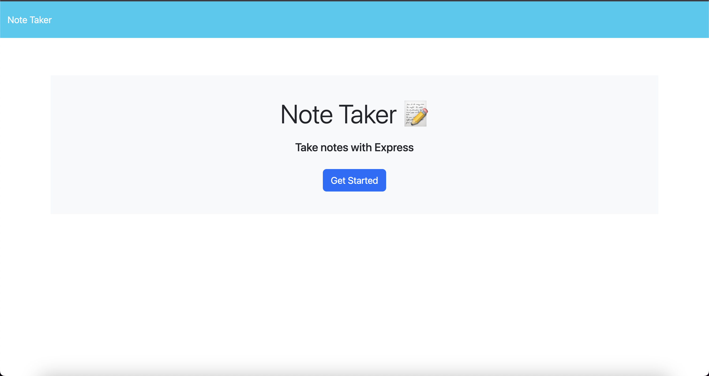

# Note Taker

## Description

This application is designed to help keep track of tasks and notes. It was created to make note taking easy, fun, and efficient. With this application, you can add, edit, and delete notes.

## Usage

To use this application, click the new note button on the homepage and start adding your notes to your dashboard. You are also able to save and delete notes by pressing the corresponding buttons.

## Credits

Starter code courtesy of Bootcamp.
